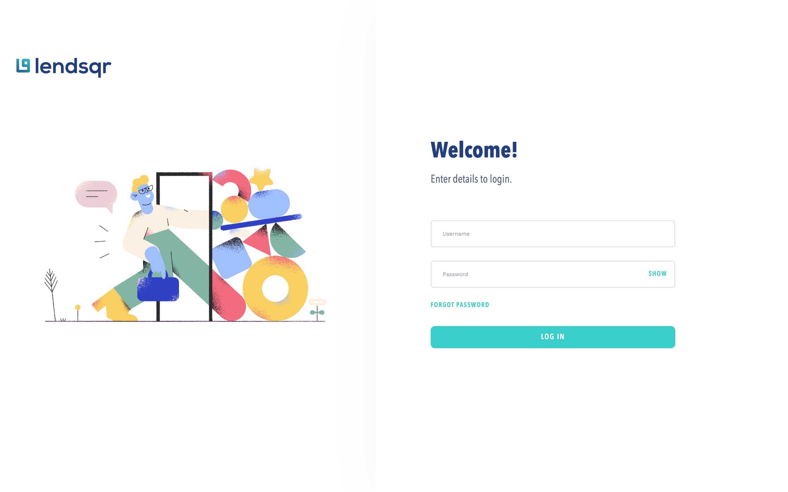
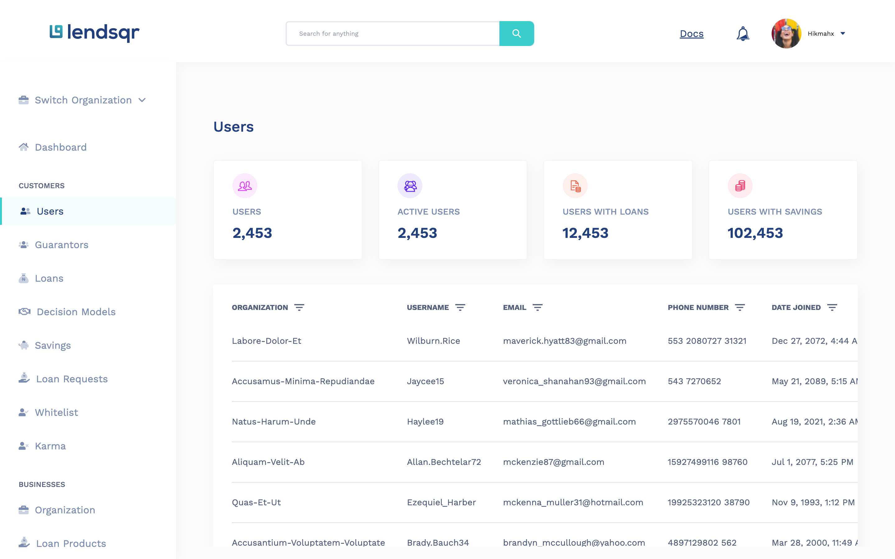

# Lendsqr

This is a test project created for Lenders.

## Table of contents

- [Overview](#overview)
  - [Screenshot](#screenshot)
      - [Mobile](#mobile)
      - [Desktop](#desktop)
  - [Link](#link)
- [My process](#my-process)
  - [Built with](#built-with)
  - [Guide](#guide)
    - [Login](#login)
    - [Dashboard](#dashboard)
      - [User Details, Filter And Pagination](#user-details-filter-and-pagination)
      - [Status](#status)
    - [User Details Page](#user-details-page)
- [Author](#author)

## Overview

### Screenshot

#### Mobile

 

 

 

 

 

#### Desktop

 

 

 

 

 

### Link

- Live Site URL: [Website Link](https://hikmah-yousuph-lendsqr-fe-test.surge.sh/)

## My process

### Built with

- SCSS
- React
- TypeScript
- Redux Toolkit
- Local Storage
- Axios
- React libraries/packages: react-hook-form,react-paginate, react-router-dom, react-toastify, react-redux, react-thunk

### Guide
To use this website, follow these steps:

#### **Login**:
Login with a username and password.
  - Your login details will be stored in the localStorage and will be removed once you log out. 
  - You won't be able to access the dashboard if you have not logged in.
  ***
#### **Dashboard**:
##### **User Details, Filter, And Pagination**
Once logged in, user details will be fetched from the mockapi. 
  - By default, only 10 details will be fetched. Feel free to change the limit at the bottom using the select option.
  - You can choose to change the page data by clicking the pagination at the bottom of the page.
  - Filter is available to filter the user details fetched by clicking on the three horizontal lines filter icon next to each of the table header. This will display a form through which you can enter your preferred filter. None of the fields are required, so filter with one or more fields.
  - Users can also choose to search user details by submitting a value to the search form in the header (for mobile view, it is available in the toggle menu, to open the menu, click on the hamburger icon in the header).
##### **Status**:
  - To update a user's status, click on the 3 vertical dots at the right-hand side of the table. The table is scrollable both horizontally and vertically for responsiveness. 
  - Once this vertical icon is clicked, a component opens which allows the activation and blacklisting of a user. Clicking either of these will bring a notification of the action.
  - User's status is stored in the local storage and changes based on the button
  - To view more details of a user, click on **View Details** link. This will make the site navigate to the user details page
  ***
#### **User Details Page**
- Every other detail of a user will be displayed here
- There are two buttons at the top of the page. Both can also be used to update the user status
- The **Back to Users** button will renavigate the site back to the dashboard

## Author

- Website - [Hikmah Yousuph](https://hikmah-yousuph.vercel.app/)
- GitHub- [@hikmahx](https://github.com/hikmahx)

